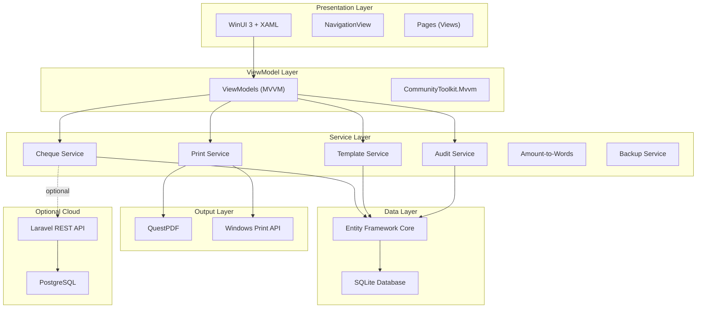
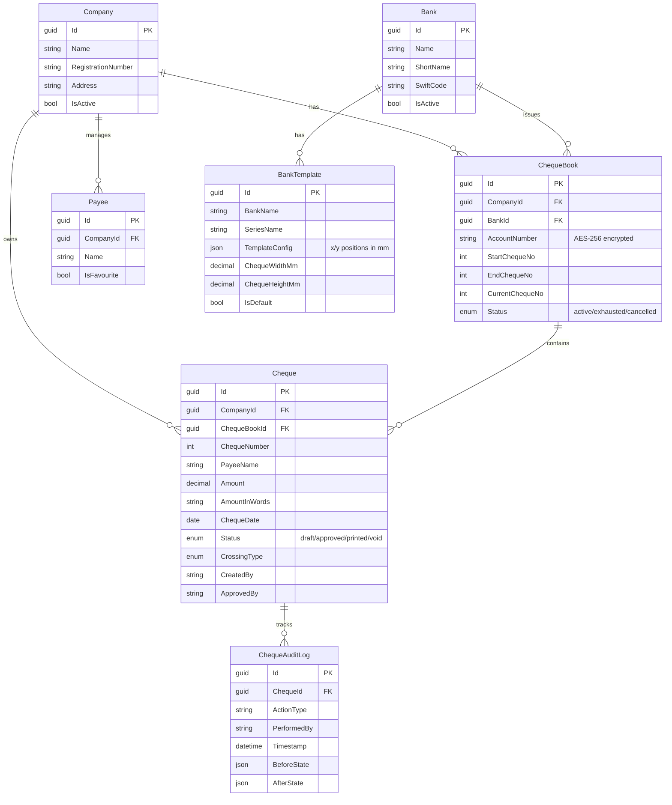
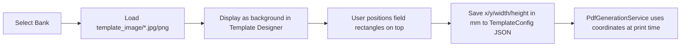
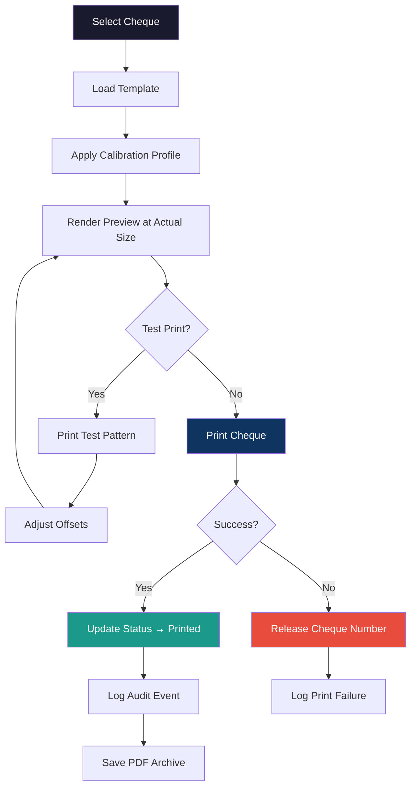

# 🏦 PrimeCheque — Super Master Plan

## Standalone Sri Lankan Cheque Writing & Printing Desktop Application

> **Document Version:** 1.0 — Master Implementation Plan
> **Based on:** Cheque Writing & Printing Module — Revised SRD v2.0 (July 23, 2026)
> **Prepared for:** PrimeOne.Global Development Team
> **Technology Stack:** C# / .NET 8 / WinUI 3 / SQLite / EF Core / QuestPDF

---

## 📋 Table of Contents

1. [Project Overview](#1-project-overview)
2. [Current Codebase Status](#2-current-codebase-status)
3. [Technology Stack](#3-technology-stack)
4. [Architecture Blueprint](#4-architecture-blueprint)
5. [Project Structure](#5-project-structure)
6. [Data Layer — Models & Database Schema](#6-data-layer--models--database-schema)
7. [Service Layer](#7-service-layer)
8. [ViewModel Layer (MVVM)](#8-viewmodel-layer-mvvm)
9. [View Layer — UI Pages & Navigation](#9-view-layer--ui-pages--navigation)
10. [Bank Template Engine](#10-bank-template-engine)
11. [Print Engine](#11-print-engine)
12. [Security & RBAC](#12-security--rbac)
13. [Sri Lankan Localisation](#13-sri-lankan-localisation)
14. [Optional Cloud Integration](#14-optional-cloud-integration)
15. [Phase-by-Phase Implementation Roadmap](#15-phase-by-phase-implementation-roadmap)
16. [Testing Strategy](#16-testing-strategy)
17. [Risk Register & Mitigations](#17-risk-register--mitigations)
18. [Success Metrics (KPIs)](#18-success-metrics-kpis)
19. [File-by-File Implementation Checklist](#19-file-by-file-implementation-checklist)

---

## 1. Project Overview

### 1.1 What Is PrimeCheque?

PrimeCheque is a **standalone Windows desktop application** for the Sri Lankan market that eliminates manual cheque-writing errors, keeps sensitive bank data on the customer's own premises, works fully offline, and provides millimetre-accurate printing onto bank-issued cheque leaves.

> [!IMPORTANT]
> This is NOT a feature bolted onto payroll software — it is an independent product similar in spirit to **Chrysanth Cheque Writer**, positioned for Sri Lankan SMEs, accounting firms, and corporate finance departments.

### 1.2 Target Market

| Segment | Description |
|---|---|
| **SMEs** | Small to Medium Enterprises in Sri Lanka |
| **Accounting Firms** | Bookkeeping service providers |
| **Payroll Bureaus** | As optional connected tool (not mandatory) |
| **Corporate Finance** | Finance departments of larger companies |
| **Manufacturing/Retail** | Businesses with supplier payments |

### 1.3 Product Editions

| Edition | Platform | Key Capabilities |
|---|---|---|
| **Personal / Small Business** | Windows desktop, single PC | 1 company, multiple bank accounts, basic cheque printing, payee management, local backup |
| **Professional** | Windows desktop, single PC or small LAN | Multiple companies, maker-checker approval, batch cheques, reports, Excel import, user accounts, encrypted backup |
| **Enterprise** | Laravel central server + Windows desktop clients | Multi-branch, approval workflow, API integration, SSO/AD, central audit logs, custom bank templates |

### 1.4 Key Value Propositions

- ✅ **Desktop-first**: exact cheque alignment, offline operation, data on premises
- ✅ **Optional integration**: connects to PrimeOne.Global payroll when wanted
- ✅ **Local compliance**: Sri Lankan bank formats, terminology, CITS compatibility
- ✅ **Bank-template depth**: Bank → Series → Paper size → Calibration hierarchy
- ✅ **Tiered standalone product**: payroll/AP integration is upsell, not core pitch

---

## 2. Current Codebase Status

### 2.1 What Exists

The project scaffold has been created with the following structure:

```
D:\PrimeOneWork\C#\PrimeCheque\
├── PrimeCheque.sln                    ✅ Solution file
├── tec-stack.md                       ✅ Tech stack reference
├── Cheque Writing Module SRD v2.pdf   ✅ Requirements document
└── PrimeCheque\
    ├── App.xaml / App.xaml.cs          ✅ App entry point (boilerplate)
    ├── MainWindow.xaml / .cs           ✅ Main window with Mica backdrop (empty Grid)
    ├── PrimeCheque.csproj              ✅ Project config with all NuGet packages
    ├── Package.appxmanifest            ✅ MSIX packaging manifest
    ├── Views\
    │   └── DashboardPage.xaml / .cs    ✅ Empty dashboard page shell
    ├── Models\                         ❌ Empty — needs entity classes
    ├── ViewModels\                     ❌ Empty — needs MVVM view models
    ├── Services\                       ❌ Empty — needs business logic
    ├── Data\                           ❌ Empty — needs EF Core DbContext
    └── Database\                       ❌ Empty — needs migrations/seed data
```

### 2.2 NuGet Packages Already Configured

| Package | Version | Purpose |
|---|---|---|
| `CommunityToolkit.Mvvm` | 8.4.2 | MVVM source generators, RelayCommand, ObservableObject |
| `Microsoft.EntityFrameworkCore.Sqlite` | 8.0.8 | SQLite database provider |
| `Microsoft.EntityFrameworkCore.Tools` | 8.0.8 | EF Core migrations tooling |
| `Microsoft.WindowsAppSDK` | 2.3.1 | WinUI 3 framework |
| `Microsoft.Windows.SDK.BuildTools` | 10.0.28000.2270 | Windows SDK build tools |
| `QuestPDF` | 2026.7.1 | PDF generation for cheque output |
| `Serilog` | 4.4.0 | Structured logging |

---

## 3. Technology Stack



---

## 4. Architecture Blueprint

### 4.1 MVVM Pattern

```
View (XAML) ──binds-to──> ViewModel (C#) ──calls──> Service ──uses──> Repository/DbContext ──> SQLite
```

### 4.2 Dependency Injection

All services registered in `App.xaml.cs` using `Microsoft.Extensions.DependencyInjection`:

```csharp
// App.xaml.cs — Service Registration
services.AddDbContext<PrimeChequeDbContext>();
services.AddSingleton<INavigationService, NavigationService>();
services.AddTransient<IChequeService, ChequeService>();
services.AddTransient<IPrintService, PrintService>();
services.AddTransient<ITemplateService, TemplateService>();
services.AddTransient<IAuditService, AuditService>();
services.AddTransient<IAmountToWordsService, AmountToWordsService>();
services.AddTransient<IChequeBookService, ChequeBookService>();
services.AddTransient<IBackupService, BackupService>();
services.AddTransient<IPayeeService, PayeeService>();
// ViewModels
services.AddTransient<DashboardViewModel>();
services.AddTransient<ChequeEntryViewModel>();
services.AddTransient<ChequeBookViewModel>();
services.AddTransient<PayeeManagementViewModel>();
services.AddTransient<PrintPreviewViewModel>();
services.AddTransient<TemplateDesignerViewModel>();
services.AddTransient<ReportsViewModel>();
services.AddTransient<SettingsViewModel>();
services.AddTransient<AuditLogViewModel>();
services.AddTransient<BatchImportViewModel>();
```

### 4.3 Offline-First Principle

> [!IMPORTANT]
> The desktop application MUST operate fully offline. Cloud API calls are optional, fire-and-forget where possible, and never block cheque preparation or printing.

---

## 5. Project Structure

### 5.1 Complete Folder & File Layout

```
PrimeCheque/
├── App.xaml
├── App.xaml.cs                          # DI container, service registration, startup
├── MainWindow.xaml                      # NavigationView shell + Frame
├── MainWindow.xaml.cs
│
├── Models/                              # EF Core entity classes
│   ├── Company.cs
│   ├── Bank.cs
│   ├── ChequeBook.cs
│   ├── Cheque.cs
│   ├── ChequeAuditLog.cs
│   ├── BankTemplate.cs
│   ├── Payee.cs
│   ├── User.cs
│   ├── UserRole.cs
│   ├── PrinterCalibration.cs
│   └── AppSettings.cs
│
├── Data/                                # EF Core DbContext & configuration
│   ├── PrimeChequeDbContext.cs
│   ├── Configurations/
│   │   ├── CompanyConfiguration.cs
│   │   ├── ChequeBookConfiguration.cs
│   │   ├── ChequeConfiguration.cs
│   │   ├── ChequeAuditLogConfiguration.cs
│   │   ├── BankTemplateConfiguration.cs
│   │   ├── PayeeConfiguration.cs
│   │   └── UserConfiguration.cs
│   └── Seed/
│       ├── BankSeedData.cs              # Sri Lankan banks
│       └── TemplateSeedData.cs          # Default bank templates
│
├── Database/                            # Migration helpers
│   └── DatabaseInitializer.cs           # Auto-migrate on first launch
│
├── Services/                            # Business logic layer
│   ├── Interfaces/
│   │   ├── IChequeService.cs
│   │   ├── IChequeBookService.cs
│   │   ├── IPrintService.cs
│   │   ├── ITemplateService.cs
│   │   ├── IAuditService.cs
│   │   ├── IAmountToWordsService.cs
│   │   ├── IPayeeService.cs
│   │   ├── IBackupService.cs
│   │   ├── IBankService.cs
│   │   ├── ICompanyService.cs
│   │   ├── INavigationService.cs
│   │   ├── IUserService.cs
│   │   └── IReportService.cs
│   ├── ChequeService.cs
│   ├── ChequeBookService.cs
│   ├── PrintService.cs
│   ├── TemplateService.cs
│   ├── AuditService.cs
│   ├── AmountToWordsService.cs          # LKR-specific conversion engine
│   ├── PayeeService.cs
│   ├── BackupService.cs
│   ├── BankService.cs
│   ├── CompanyService.cs
│   ├── NavigationService.cs
│   ├── UserService.cs
│   ├── ReportService.cs
│   └── PdfGenerationService.cs          # QuestPDF-based cheque rendering
│
├── ViewModels/                          # MVVM ViewModels
│   ├── DashboardViewModel.cs
│   ├── ChequeEntryViewModel.cs
│   ├── ChequeListViewModel.cs
│   ├── ChequeBookViewModel.cs
│   ├── PayeeManagementViewModel.cs
│   ├── PrintPreviewViewModel.cs
│   ├── TemplateDesignerViewModel.cs
│   ├── BatchImportViewModel.cs
│   ├── ReportsViewModel.cs
│   ├── AuditLogViewModel.cs
│   ├── SettingsViewModel.cs
│   ├── CompanyManagementViewModel.cs
│   ├── BankManagementViewModel.cs
│   └── UserManagementViewModel.cs
│
├── Views/                               # XAML Pages
│   ├── DashboardPage.xaml / .cs
│   ├── ChequeEntryPage.xaml / .cs
│   ├── ChequeListPage.xaml / .cs
│   ├── ChequeBookPage.xaml / .cs
│   ├── PayeeManagementPage.xaml / .cs
│   ├── PrintPreviewPage.xaml / .cs
│   ├── TemplateDesignerPage.xaml / .cs
│   ├── BatchImportPage.xaml / .cs
│   ├── ReportsPage.xaml / .cs
│   ├── AuditLogPage.xaml / .cs
│   ├── SettingsPage.xaml / .cs
│   ├── CompanyManagementPage.xaml / .cs
│   ├── BankManagementPage.xaml / .cs
│   └── UserManagementPage.xaml / .cs
│
├── Converters/                          # XAML value converters
│   ├── StatusToColorConverter.cs
│   ├── BoolToVisibilityConverter.cs
│   ├── AmountFormatConverter.cs
│   └── DateFormatConverter.cs
│
├── Helpers/                             # Utility classes
│   ├── EncryptionHelper.cs              # AES-256 encryption
│   ├── ValidationHelper.cs
│   ├── ExcelImportHelper.cs
│   └── PrintCalibrationHelper.cs
│
├── Themes/                              # Custom styles & resources
│   ├── AppTheme.xaml
│   ├── Colors.xaml
│   └── Styles.xaml
│
└── Assets/                              # Images, icons, splash screens
    └── (existing logo/splash PNGs)
```

---

## 6. Data Layer — Models & Database Schema

### 6.1 Entity Models

#### Company

```csharp
public class Company
{
    public Guid Id { get; set; }
    public string Name { get; set; } = string.Empty;
    public string? RegistrationNumber { get; set; }
    public string? Address { get; set; }
    public string? Phone { get; set; }
    public string? Email { get; set; }
    public bool IsActive { get; set; } = true;
    public DateTime CreatedAt { get; set; }
    public DateTime? UpdatedAt { get; set; }

    // Navigation
    public ICollection<ChequeBook> ChequeBooks { get; set; } = [];
    public ICollection<Cheque> Cheques { get; set; } = [];
    public ICollection<Payee> Payees { get; set; } = [];
}
```

#### Bank

```csharp
public class Bank
{
    public Guid Id { get; set; }
    public string Name { get; set; } = string.Empty;          // e.g. "Commercial Bank of Ceylon"
    public string? ShortName { get; set; }                     // e.g. "COMBANK"
    public string? BranchCode { get; set; }
    public string? SwiftCode { get; set; }
    public bool IsActive { get; set; } = true;
    public DateTime CreatedAt { get; set; }

    // Navigation
    public ICollection<ChequeBook> ChequeBooks { get; set; } = [];
    public ICollection<BankTemplate> Templates { get; set; } = [];
}
```

#### ChequeBook

```csharp
public class ChequeBook
{
    public Guid Id { get; set; }
    public Guid CompanyId { get; set; }
    public Guid BankId { get; set; }
    public string AccountNumber { get; set; } = string.Empty;  // Stored encrypted (AES-256)
    public string MaskedAccountNumber { get; set; } = string.Empty;
    public int StartChequeNo { get; set; }
    public int EndChequeNo { get; set; }
    public int CurrentChequeNo { get; set; }
    public ChequeBookStatus Status { get; set; } = ChequeBookStatus.Active;
    public DateTime CreatedAt { get; set; }

    // Navigation
    public Company Company { get; set; } = null!;
    public Bank Bank { get; set; } = null!;
    public ICollection<Cheque> Cheques { get; set; } = [];
}

public enum ChequeBookStatus { Active, Exhausted, Cancelled }
```

#### Cheque

```csharp
public class Cheque
{
    public Guid Id { get; set; }
    public Guid CompanyId { get; set; }
    public Guid ChequeBookId { get; set; }
    public int ChequeNumber { get; set; }
    public string PayeeName { get; set; } = string.Empty;
    public decimal Amount { get; set; }
    public string AmountInWords { get; set; } = string.Empty;
    public DateOnly ChequeDate { get; set; }
    public string? Memo { get; set; }
    public ChequeStatus Status { get; set; } = ChequeStatus.Draft;
    public CrossingType CrossingType { get; set; } = CrossingType.None;
    public string? CreatedBy { get; set; }
    public string? ApprovedBy { get; set; }
    public DateTime? PrintedAt { get; set; }
    public string? PdfPath { get; set; }
    public DateTime CreatedAt { get; set; }
    public DateTime? UpdatedAt { get; set; }

    // Navigation
    public Company Company { get; set; } = null!;
    public ChequeBook ChequeBook { get; set; } = null!;
    public ICollection<ChequeAuditLog> AuditLogs { get; set; } = [];
}

public enum ChequeStatus { Draft, Approved, Printed, Void, StopPayment }
public enum CrossingType { None, AccountPayeeOnly, NotNegotiable, AccountPayeeAndNotNegotiable }
```

#### ChequeAuditLog (append-only)

```csharp
public class ChequeAuditLog
{
    public Guid Id { get; set; }
    public Guid ChequeId { get; set; }
    public string ActionType { get; set; } = string.Empty;   // created, approved, printed, voided, etc.
    public string PerformedBy { get; set; } = string.Empty;
    public DateTime Timestamp { get; set; }                   // ISO 8601 with timezone
    public string? BeforeState { get; set; }                  // JSON
    public string? AfterState { get; set; }                   // JSON

    // Navigation
    public Cheque Cheque { get; set; } = null!;
}
```

#### BankTemplate

```csharp
public class BankTemplate
{
    public Guid Id { get; set; }
    public string BankName { get; set; } = string.Empty;
    public string SeriesName { get; set; } = string.Empty;     // e.g. "Current Account Cheque – Series A"
    public string TemplateConfig { get; set; } = "{}";         // JSON: field positions (x, y coordinates in mm)
    public string? TemplateImagePath { get; set; }             // Relative path to cheque background image (e.g. "template_image/BOC_LK.png")
    public decimal ChequeWidthMm { get; set; }
    public decimal ChequeHeightMm { get; set; }
    public bool IsDefault { get; set; }                        // System-provided template
    public Guid? CompanyId { get; set; }                       // Custom templates per company (nullable)
    public Guid? BankId { get; set; }
    public DateTime CreatedAt { get; set; }

    // Navigation
    public Bank? Bank { get; set; }
    public Company? Company { get; set; }
}
```

#### Payee

```csharp
public class Payee
{
    public Guid Id { get; set; }
    public Guid CompanyId { get; set; }
    public string Name { get; set; } = string.Empty;
    public string? NickName { get; set; }
    public string? DefaultMemo { get; set; }
    public decimal? LastAmount { get; set; }
    public bool IsFavourite { get; set; }
    public DateTime CreatedAt { get; set; }

    // Navigation
    public Company Company { get; set; } = null!;
}
```

#### User & UserRole

```csharp
public class User
{
    public Guid Id { get; set; }
    public string Username { get; set; } = string.Empty;
    public string PasswordHash { get; set; } = string.Empty;
    public string DisplayName { get; set; } = string.Empty;
    public UserRole Role { get; set; } = UserRole.ChequePreparer;
    public bool IsActive { get; set; } = true;
    public DateTime CreatedAt { get; set; }
    public DateTime? LastLoginAt { get; set; }
    public int FailedLoginAttempts { get; set; }
    public DateTime? LockedUntil { get; set; }
}

public enum UserRole
{
    Administrator,
    ChequePreparer,
    Approver,
    Printer,
    Auditor
}
```

#### PrinterCalibration

```csharp
public class PrinterCalibration
{
    public Guid Id { get; set; }
    public string PrinterName { get; set; } = string.Empty;
    public string? TrayName { get; set; }
    public decimal HorizontalOffsetMm { get; set; }
    public decimal VerticalOffsetMm { get; set; }
    public Guid? TemplateId { get; set; }
    public DateTime CreatedAt { get; set; }
    public DateTime? UpdatedAt { get; set; }
}
```

### 6.2 Database Schema Diagram



---

## 7. Service Layer

### 7.1 Core Services

| Service | Responsibility |
|---|---|
| **ChequeService** | Create, update, approve, void, search cheques; assign cheque numbers from books; duplicate detection |
| **ChequeBookService** | Register cheque books, track used/remaining leaves, missing-sequence warnings, stop-payment |
| **AmountToWordsService** | Convert LKR amounts to Sri Lankan English words with configurable prefix/suffix/format |
| **PrintService** | Windows Print API integration, printer/tray selection, calibration, test prints, double-print prevention |
| **PdfGenerationService** | QuestPDF-based cheque rendering with template field positioning, watermarks (DUPLICATE/VOID/COPY) |
| **TemplateService** | CRUD for bank templates, JSON template config parsing, template hierarchy management |
| **AuditService** | Append-only audit logging for all cheque lifecycle events (create, approve, print, void, etc.) |
| **PayeeService** | Payee directory with typeahead search, favourites, last-used amounts |
| **BackupService** | Local automated backups + optional encrypted cloud backup (AES-256) |
| **BankService** | Bank master data CRUD |
| **CompanyService** | Company master data CRUD |
| **UserService** | Authentication, RBAC enforcement, session timeout, failed-login lockout |
| **ReportService** | Cheque register, PDC report, void register, cheque book usage, audit report, reconciliation |
| **NavigationService** | Frame-based page navigation within MainWindow |

### 7.2 Amount-to-Words Engine (Critical Feature)

```csharp
public interface IAmountToWordsService
{
    string Convert(decimal amount, AmountToWordsOptions options);
}

public class AmountToWordsOptions
{
    public string Prefix { get; set; } = "Sri Lanka Rupees";     // or "Rupees" or ""
    public string Suffix { get; set; } = "Only";
    public string CentsWord { get; set; } = "Cents";
    public bool UseAnd { get; set; } = true;                      // "and Cents Fifty"
    public bool Uppercase { get; set; } = false;
    public string StartSymbol { get; set; } = "**";
    public string EndSymbol { get; set; } = "**";
    public int MaxLineLength { get; set; } = 80;
    public bool TwoLineFormat { get; set; } = false;
}
```

**Examples:**
- `75000.00` → `**Sri Lanka Rupees Seventy-Five Thousand Only**`
- `82500.50` → `**Sri Lanka Rupees Eighty-Two Thousand Five Hundred and Cents Fifty Only**`

> [!CAUTION]
> The stored numeric amount and the printed amount-in-words MUST be generated from the same immutable value. Never automatically round an amount without showing the user.

---

## 8. ViewModel Layer (MVVM)

Each ViewModel uses `CommunityToolkit.Mvvm` source generators:

### 8.1 Key ViewModels

| ViewModel | Commands | Observable Properties |
|---|---|---|
| **DashboardViewModel** | `NavigateToChequeEntry`, `NavigateToChequeList` | `TotalChequesToday`, `PendingApprovals`, `RecentCheques`, `ChequeBookSummaries` |
| **ChequeEntryViewModel** | `SaveDraft`, `SubmitForApproval`, `PrintCheque`, `PreviewCheque` | `SelectedCompany`, `SelectedChequeBook`, `PayeeName`, `Amount`, `AmountInWords`, `ChequeDate`, `Memo`, `CrossingType` |
| **ChequeListViewModel** | `SearchCheques`, `VoidCheque`, `ReprintCheque`, `ExportPdf` | `ChequeList`, `FilterStatus`, `FilterDateRange`, `FilterBank`, `FilterPayee` |
| **ChequeBookViewModel** | `AddChequeBook`, `EditChequeBook`, `CancelChequeBook` | `ChequeBooks`, `SelectedBook`, `UsedLeaves`, `RemainingLeaves` |
| **PayeeManagementViewModel** | `AddPayee`, `EditPayee`, `DeletePayee`, `ToggleFavourite` | `Payees`, `SearchText` |
| **PrintPreviewViewModel** | `Print`, `ExportPdf`, `AdjustCalibration`, `TestPrint` | `PreviewImage`, `SelectedPrinter`, `SelectedTray`, `HOffset`, `VOffset` |
| **TemplateDesignerViewModel** | `SaveTemplate`, `LoadTemplate`, `ExportJson`, `ImportJson`, `LoadBackgroundImage` | `Fields`, `ChequeWidth`, `ChequeHeight`, `BackgroundImage`, `SelectedBank`, `TemplateImagePath`, `FieldOverlayVisible` |
| **BatchImportViewModel** | `ImportExcel`, `ImportCsv`, `ValidateBatch`, `ApproveBatch`, `PrintBatch` | `ImportedRows`, `ValidationErrors`, `TotalAmount`, `ChequeCount` |
| **ReportsViewModel** | `GenerateReport`, `ExportReport` | `SelectedReportType`, `DateRange`, `ReportData` |
| **AuditLogViewModel** | `Search`, `Export` | `AuditEntries`, `FilterUser`, `FilterAction`, `FilterDate` |
| **SettingsViewModel** | `SaveSettings`, `ChangePassword`, `ManagePrinters` | `AmountWordOptions`, `DefaultCompany`, `BackupSettings`, `PrinterCalibrations` |

---

## 9. View Layer — UI Pages & Navigation

### 9.1 MainWindow Navigation Structure

The MainWindow uses a `NavigationView` with side navigation:

```
┌─────────────────────────────────────────────────────────────────┐
│ PrimeCheque                                        [User] [⚙️] │
├──────────────┬──────────────────────────────────────────────────┤
│              │                                                  │
│ 🏠 Dashboard │              [Page Content Frame]                │
│              │                                                  │
│ ✏️ New Cheque│                                                  │
│              │                                                  │
│ 📋 Cheques   │                                                  │
│              │                                                  │
│ 📒 Cheque    │                                                  │
│    Books     │                                                  │
│              │                                                  │
│ 👥 Payees    │                                                  │
│              │                                                  │
│ 📥 Batch     │                                                  │
│    Import    │                                                  │
│              │                                                  │
│ 📊 Reports   │                                                  │
│              │                                                  │
│ 📜 Audit Log │                                                  │
│              │                                                  │
│ ─────────── │                                                  │
│ 🏢 Companies │                                                  │
│ 🏦 Banks     │                                                  │
│ 👤 Users     │                                                  │
│ 🎨 Templates │                                                  │
│              │                                                  │
│ ⚙️ Settings  │                                                  │
└──────────────┴──────────────────────────────────────────────────┘
```

### 9.2 Page Inventory

| # | Page | Purpose | Priority |
|---|---|---|---|
| 1 | **DashboardPage** | Overview: today's cheques, pending approvals, quick actions | 🔴 Phase 1 |
| 2 | **ChequeEntryPage** | Create/edit a single cheque with real-time preview | 🔴 Phase 1 |
| 3 | **ChequeListPage** | Search, filter, view all cheques with status badges | 🔴 Phase 1 |
| 4 | **ChequeBookPage** | Manage cheque books, track leaves, missing-sequence alerts | 🔴 Phase 1 |
| 5 | **PrintPreviewPage** | Actual-size preview, printer selection, calibration, print | 🔴 Phase 1 |
| 6 | **PayeeManagementPage** | Payee directory with typeahead, favourites | 🟡 Phase 1 |
| 7 | **CompanyManagementPage** | Company master data | 🟡 Phase 1 |
| 8 | **BankManagementPage** | Bank master data | 🟡 Phase 1 |
| 9 | **SettingsPage** | Amount-to-words config, backup settings, printer calibration | 🟡 Phase 1 |
| 10 | **BatchImportPage** | Excel/CSV import, validation, bulk approval | 🟠 Phase 2 |
| 11 | **TemplateDesignerPage** | Visual template editor: loads real bank cheque images from `template_image/` as background, overlays draggable field rectangles (date, payee, amount, crossing, memo) with mm coordinates, ruler guides | 🟠 Phase 2 |
| 12 | **ReportsPage** | Cheque register, PDC, void, usage, reconciliation reports | 🟠 Phase 2 |
| 13 | **AuditLogPage** | Searchable audit trail viewer | 🟠 Phase 2 |
| 14 | **UserManagementPage** | RBAC user management (Professional/Enterprise) | 🔵 Phase 3 |

### 9.3 Cheque Entry Workflow (≤ 3 clicks to print)


---

## 10. Bank Template Engine

### 10.1 Template Configuration (JSON)

Each bank template stores field positions in JSON format:

```json
{
  "bankName": "Commercial Bank of Ceylon",
  "seriesName": "Current Account Cheque – Series A",
  "chequeWidthMm": 200,
  "chequeHeightMm": 88,
  "fields": {
    "dateDay": { "x": 152, "y": 12, "width": 12, "height": 6, "fontSize": 11 },
    "dateMonth": { "x": 164, "y": 12, "width": 12, "height": 6, "fontSize": 11 },
    "dateYear": { "x": 176, "y": 12, "width": 18, "height": 6, "fontSize": 11 },
    "payeeLine1": { "x": 35, "y": 25, "width": 150, "height": 7, "fontSize": 12 },
    "payeeLine2": { "x": 12, "y": 33, "width": 170, "height": 7, "fontSize": 12 },
    "amountWordsLine1": { "x": 12, "y": 42, "width": 165, "height": 7, "fontSize": 11 },
    "amountWordsLine2": { "x": 12, "y": 50, "width": 130, "height": 7, "fontSize": 11 },
    "amountFigures": { "x": 158, "y": 42, "width": 35, "height": 8, "fontSize": 12 },
    "crossingZone": { "x": 8, "y": 5, "width": 30, "height": 18 },
    "signatureZone": { "x": 130, "y": 65, "width": 60, "height": 15 },
    "memoLine": { "x": 12, "y": 70, "width": 100, "height": 6, "fontSize": 9 }
  },
  "excludeZones": [
    { "label": "MICR line", "x": 0, "y": 78, "width": 200, "height": 10 },
    { "label": "Bank logo", "x": 5, "y": 2, "width": 25, "height": 15 }
  ]
}
```

### 10.2 Supported Sri Lankan Banks & Template Images

Each bank has a real cheque template image stored in `PrimeCheque/template_image/` (sourced from existing cheque writing tool output). These serve as **visual background references** in the Template Designer, so the user can precisely position field rectangles on the actual cheque layout.

| # | Bank | Short Name | Template Image File |
|---|---|---|---|
| 1 | Bank of Ceylon | BOC | `BOC_LK.png` |
| 2 | Commercial Bank of Ceylon | COMBANK | `CommercialBankOfCeylon_LK.png` |
| 3 | Sampath Bank | SAMPATH | `SampathBank_LK.png` |
| 4 | Hatton National Bank | HNB | `HattonNationalBank_LK.jpg` |
| 5 | Nations Trust Bank | NTB | `NationsTrustBank_LK.png` |
| 6 | DFCC Bank | DFCC | `DFCCBank_LK.jpg` |
| 7 | Seylan Bank | SEYLAN | `SeylanBank_LK.png` |
| 8 | Pan Asia Bank (PABC) | PABC | `PanAsiaBank_LK.jpg` |
| 9 | Pan Asia Bank – First Class | PABC-FC | `PanAsiaBank_FirstClass_LK.jpg` |
| 10 | People's Bank | PB | `PeoplesBank_LK.jpg` |
| 11 | NDB Bank | NDB | `NDB_LK.jpg` |
| 12 | Amana Bank | AMANA | `AmanaBank_LK.jpg` |
| 13 | Cargills Bank | CARGILLS | `CargillsBank_LK.jpg` |
| 14 | Union Bank | UNION | `UnionBank_LK.jpg` |
| 15 | HSBC Advance | HSBC | `HSBC_Advance_LK.jpg` |
| 16 | Citibank | CITI | `Citibank_LK.jpg` |
| 17 | Standard Chartered | STANCHART | `StandardChartered_LK.jpg` |
| 18 | Public Bank | PUBLIC | `PublicBank_LK.jpg` |

### 10.2.1 Template Image Workflow



- The Template Designer loads the bank's cheque image as a **scaled background** on a Canvas
- Semi-transparent colored rectangles represent each field (Date, Payee, Amount Words, Amount Figures, Crossing, Memo)
- The user adjusts field positions using **NumberBox** controls (mm precision) or by **dragging** the rectangles directly
- Coordinates are saved as the `TemplateConfig` JSON into the `BankTemplate` table
- At print time, the `PdfGenerationService` reads these coordinates to position text on the **blank cheque leaf** (the background image is for design reference only, not printed)

> [!WARNING]
> Publish a template ONLY after testing it against an actual cheque leaf lawfully supplied by a customer or bank. The images above are from an existing cheque writing tool and serve as design references only.

### 10.3 Template Hierarchy

```
Bank (e.g., Commercial Bank of Ceylon)
  └── Cheque Series/Template (e.g., Current Account – Series A)
        └── Paper Size (e.g., 200mm × 88mm)
              └── Printer Calibration Profile (e.g., HP LaserJet offset: +2mm H, -1mm V)
```

---

## 11. Print Engine

### 11.1 Printing Workflow



### 11.2 Print Controls

| Feature | Description |
|---|---|
| **Printer selection** | Enumerate Windows printers, save default per template |
| **Tray selection** | Manual tray selection for cheque stock |
| **Orientation** | Landscape/Portrait per template |
| **Actual-size printing** | "Fit to page" DISABLED by default |
| **Calibration** | Horizontal & vertical offset in mm, saved per printer |
| **Test print** | Alignment verification grid overlay |
| **Double-print prevention** | Button disabled after print command; requires confirmation for reprint |
| **Watermarks** | "DUPLICATE", "VOID", "COPY" for reprints |
| **PDF export** | Per-cheque PDF archive, batch ZIP export |

---

## 12. Security & RBAC

### 12.1 Role Permissions Matrix

| Permission | Administrator | Cheque Preparer | Approver | Printer | Auditor |
|---|---|---|---|---|---|
| Create cheque | ✅ | ✅ | ❌ | ❌ | ❌ |
| Approve cheque | ✅ | ❌ | ✅ | ❌ | ❌ |
| Print cheque | ✅ | ❌ | ❌ | ✅ | ❌ |
| Void cheque | ✅ | ❌ | ✅ | ❌ | ❌ |
| View audit log | ✅ | ❌ | ❌ | ❌ | ✅ |
| Manage users | ✅ | ❌ | ❌ | ❌ | ❌ |
| Manage templates | ✅ | ❌ | ❌ | ❌ | ❌ |
| Manage companies | ✅ | ❌ | ❌ | ❌ | ❌ |
| Generate reports | ✅ | ✅ | ✅ | ✅ | ✅ |
| Batch import | ✅ | ✅ | ❌ | ❌ | ❌ |

### 12.2 Security Features

- **AES-256 encryption** for sensitive data (account numbers) at rest
- **Session timeout** after configurable inactivity period
- **Failed login lockout** after repeated attempts (default: 5 attempts → 15 min lock)
- **Maker-checker approval** (Professional/Enterprise editions)
- **Multi-level approval** above configurable threshold
- **Append-only audit trail** — corrections create new events, never overwrite
- **IP whitelisting** for networked/Enterprise deployments

---

## 13. Sri Lankan Localisation

### 13.1 Cheque Terminology

| Application Term | Sri Lankan Usage |
|---|---|
| Cheque Date | Date shown on the cheque |
| Payee | Person or organisation to whom payment is made |
| Drawer | Account holder issuing the cheque |
| Drawee Bank | Bank on which the cheque is drawn |
| Bearer Cheque | Payable to the named person or bearer |
| Order Cheque | Payable to the named payee or according to their order |
| Crossed Cheque | Cheque containing crossing instructions |
| Account Payee Only | Intended to be credited to the payee's account |
| Not Negotiable | Crossing that limits negotiability-related rights |
| Post-Dated Cheque | Cheque bearing a future date |
| Stale Cheque | Cheque presented after bank's accepted validity period |
| Cancelled Cheque | Cheque marked as cancelled |
| Dishonoured Cheque | Cheque bank refuses to pay |
| Stop Payment | Instruction from account holder not to pay |
| Cheque Leaf | Individual cheque from a bank-issued cheque book |
| Cheque Book | Bank-issued collection of numbered cheque leaves |

### 13.2 CITS Compatibility Requirements

All printed content must be:
- ✅ Clearly readable and properly aligned
- ✅ High contrast, free from overlapping text
- ✅ Suitable for image capture
- ✅ Kept away from bank-use and machine-readable areas (MICR line)

> [!IMPORTANT]
> **Scope for first release**: Print variable information ONLY onto original bank-issued cheque leaves (date, payee, amount words, amount figures, crossing, reference text). DO NOT print bank logos, security artwork, or machine-readable banking data.

---

## 14. Optional Cloud Integration

### 14.1 Cloud API Endpoints (Laravel)

| Method | Endpoint | Description |
|---|---|---|
| POST | `/api/v1/licences/activate` | Activate a desktop licence |
| GET | `/api/v1/licences/status` | Check licence/subscription status |
| GET | `/api/v1/templates` | List available bank templates |
| GET | `/api/v1/templates/:id` | Download a specific bank template |
| POST | `/api/v1/backup` | Upload encrypted local backup |
| GET | `/api/v1/backup/:id` | Restore encrypted backup |
| POST | `/api/v1/support/tickets` | Create a support ticket |

### 14.2 Offline Grace Period

> The desktop app includes an offline licence grace period so a temporary connectivity loss **never blocks printing**.

---

## 15. Phase-by-Phase Implementation Roadmap

### Phase 1: Alpha (Internal) — Core Desktop Application 🔴

**Goal:** Working cheque entry → preview → print pipeline with local database

| # | Task | Files | Est. |
|---|---|---|---|
| 1.1 | Set up DI container & service registration | `App.xaml.cs` | 0.5d |
| 1.2 | Create all Model classes (entities + enums) | `Models/*.cs` | 1d |
| 1.3 | Create DbContext with Fluent API configs | `Data/PrimeChequeDbContext.cs`, `Data/Configurations/*.cs` | 1d |
| 1.4 | Database initializer (auto-migrate + seed banks) | `Database/DatabaseInitializer.cs`, `Data/Seed/*.cs` | 0.5d |
| 1.5 | NavigationService + MainWindow NavigationView shell | `MainWindow.xaml`, `Services/NavigationService.cs` | 1d |
| 1.6 | CompanyService + CompanyManagementPage | `Services/CompanyService.cs`, `Views/CompanyManagementPage.xaml` | 1d |
| 1.7 | BankService + BankManagementPage | `Services/BankService.cs`, `Views/BankManagementPage.xaml` | 1d |
| 1.8 | ChequeBookService + ChequeBookPage | `Services/ChequeBookService.cs`, `Views/ChequeBookPage.xaml` | 1.5d |
| 1.9 | PayeeService + PayeeManagementPage | `Services/PayeeService.cs`, `Views/PayeeManagementPage.xaml` | 1d |
| 1.10 | AmountToWordsService (LKR engine) | `Services/AmountToWordsService.cs` | 1d |
| 1.11 | ChequeService + ChequeEntryPage (single cheque) | `Services/ChequeService.cs`, `Views/ChequeEntryPage.xaml` | 2d |
| 1.12 | AuditService (append-only logging) | `Services/AuditService.cs` | 0.5d |
| 1.13 | PdfGenerationService (QuestPDF) | `Services/PdfGenerationService.cs` | 2d |
| 1.14 | PrintService (Windows Print API) | `Services/PrintService.cs` | 2d |
| 1.15 | PrintPreviewPage (actual-size, calibration) | `Views/PrintPreviewPage.xaml` | 2d |
| 1.16 | ChequeListPage (search, filter, status) | `Views/ChequeListPage.xaml` | 1.5d |
| 1.17 | DashboardPage (overview, quick actions) | `Views/DashboardPage.xaml` | 1d |
| 1.18 | SettingsPage (amount-to-words config, backup) | `Views/SettingsPage.xaml` | 1d |
| 1.19 | Themes & styling (Mica, accent colors) | `Themes/*.xaml` | 1d |
| | **Phase 1 Total** | | **~21 days** |

### Phase 2: Beta (Pilot Customers) 🟠

| # | Task | Est. |
|---|---|---|
| 2.1 | TemplateDesignerPage (drag-and-drop, ruler guides) | 3d |
| 2.2 | Bank template testing with real cheque stock | 5d |
| 2.3 | Printer calibration workflow refinement | 2d |
| 2.4 | BatchImportPage (Excel/CSV import) | 2d |
| 2.5 | ReportsPage (all 6 report types) | 3d |
| 2.6 | AuditLogPage (searchable audit viewer) | 1.5d |
| 2.7 | Backup/Restore (local automated + encrypted) | 2d |
| 2.8 | PDC register with maturity reminders | 1d |
| 2.9 | Missing-sequence warnings | 0.5d |
| 2.10 | Duplicate payee & amount mismatch protection | 1d |
| | **Phase 2 Total** | **~21 days** |

### Phase 3: General Availability 🔵

| # | Task | Est. |
|---|---|---|
| 3.1 | UserManagementPage (RBAC) | 2d |
| 3.2 | Maker-checker approval workflow | 2d |
| 3.3 | Licence activation (cloud API integration) | 2d |
| 3.4 | Template update service (cloud sync) | 1d |
| 3.5 | MSIX installer packaging | 1d |
| 3.6 | Help documentation & tooltips | 2d |
| 3.7 | Performance optimisation | 1d |
| 3.8 | Security hardening (encryption, lockout, session timeout) | 2d |
| | **Phase 3 Total** | **~13 days** |

### Phase 4: Post-Launch 🟢

| # | Task | Est. |
|---|---|---|
| 4.1 | Usage monitoring & telemetry | 2d |
| 4.2 | Optional payroll connector | 3d |
| 4.3 | Optional AP connector | 3d |
| 4.4 | Optional accounting journal posting | 2d |
| 4.5 | Iterative bank-template additions | Ongoing |
| 4.6 | Enterprise edition features (multi-branch, SSO) | TBD |

---

## 16. Testing Strategy

### 16.1 Unit Tests

| Area | Test Cases |
|---|---|
| **Amount-to-words** | 0, 0.01, 1, 99, 100, 1000, 75000.00, 82500.50, 999999999.99, negative values, overflow |
| **Cheque number** | Increment logic, duplicate prevention, boundary (start/end), exhausted book |
| **Date validation** | No backdating beyond limit (3 months), PDC max future date, stale cheque detection |
| **Template positioning** | Field coordinate calculations in mm, exclude zone validation |

### 16.2 Integration Tests

| Area | Test Cases |
|---|---|
| **PDF generation** | Single cheque, batch, watermarks, all template fields |
| **Database** | CRUD operations, audit log append-only, concurrent access |
| **Import** | Excel/CSV parsing, validation errors, edge cases |

### 16.3 Print & Physical Testing

- Verify alignment on HP, Epson, Canon printers
- Test with real bank-issued cheque stock per supported bank
- Calibration workflow accuracy at actual size

---

## 17. Risk Register & Mitigations

| Risk | Impact | Mitigation |
|---|---|---|
| **Print misalignment** | 🔴 High | Per-printer calibration, mandatory test print, multi-printer testing |
| **Bank format changes** | 🟡 Medium | Hierarchical template system, monitor bank announcements |
| **Cheque fraud** | 🔴 High | Maker-checker approval, missing-sequence warnings, append-only audit |
| **Regulatory exposure** | 🔴 High | Legal review before release, avoid prohibited claims (Section 3.2) |
| **Blank-cheque/MICR misuse** | 🔴 High | Deferred to enterprise/custom-bank-approved edition |
| **User adoption resistance** | 🟡 Medium | Training materials, onboarding support, offline-first as selling point |

---

## 18. Success Metrics (KPIs)

### Product Adoption
- **Activation rate**: % of licensed customers printing within 30 days
- **Usage frequency**: Average cheques per customer per month

### Technical Performance
- **Print error rate**: Target < 2%
- **Cheque generation time**: Target < 2 seconds
- **Batch processing (100 cheques)**: Target < 30 seconds
- **PDF generation per cheque**: Target < 1 second

### Business Metrics
- Licence revenue by edition
- Customer satisfaction (NPS)
- Support ticket volume (printing/alignment)

---

## 19. File-by-File Implementation Checklist

### Models (Phase 1)
- [x] `Models/Company.cs`
- [x] `Models/Bank.cs`
- [x] `Models/ChequeBook.cs` + `ChequeBookStatus` enum
- [x] `Models/Cheque.cs` + `ChequeStatus` enum + `CrossingType` enum
- [x] `Models/ChequeAuditLog.cs`
- [x] `Models/BankTemplate.cs`
- [x] `Models/Payee.cs`
- [x] `Models/User.cs` + `UserRole` enum
- [x] `Models/PrinterCalibration.cs`
- [x] `Models/AppSettings.cs`

### Data Layer (Phase 1)
- [x] `Data/PrimeChequeDbContext.cs`
- [x] `Data/Configurations/CompanyConfiguration.cs`
- [x] `Data/Configurations/ChequeBookConfiguration.cs`
- [x] `Data/Configurations/ChequeConfiguration.cs`
- [x] `Data/Configurations/ChequeAuditLogConfiguration.cs`
- [x] `Data/Configurations/BankTemplateConfiguration.cs`
- [x] `Data/Configurations/PayeeConfiguration.cs`
- [x] `Data/Configurations/UserConfiguration.cs`
- [x] `Data/Seed/BankSeedData.cs`
- [x] `Data/Seed/TemplateSeedData.cs`
- [x] `Database/DatabaseInitializer.cs`

### Services (Phase 1-2)
- [x] `Services/Interfaces/` (all 15 interfaces)
- [x] `Services/NavigationService.cs`
- [x] `Services/CompanyService.cs`
- [x] `Services/BankService.cs`
- [x] `Services/ChequeBookService.cs`
- [x] `Services/PayeeService.cs`
- [x] `Services/AmountToWordsService.cs`
- [x] `Services/ChequeService.cs`
- [x] `Services/AuditService.cs`
- [x] `Services/PdfGenerationService.cs`
- [x] `Services/PrintService.cs`
- [x] `Services/TemplateService.cs`
- [x] `Services/BackupService.cs`
- [x] `Services/UserService.cs`
- [x] `Services/ReportService.cs`
- [x] `Services/LicenceService.cs`

### ViewModels (Phase 1-3)
- [x] `ViewModels/DashboardViewModel.cs`
- [x] `ViewModels/ChequeEntryViewModel.cs`
- [x] `ViewModels/ChequeListViewModel.cs`
- [x] `ViewModels/ChequeBookViewModel.cs`
- [x] `ViewModels/PayeeManagementViewModel.cs`
- [x] `ViewModels/PrintPreviewViewModel.cs`
- [x] `ViewModels/CompanyManagementViewModel.cs`
- [x] `ViewModels/BankManagementViewModel.cs`
- [x] `ViewModels/SettingsViewModel.cs`
- [x] `ViewModels/TemplateDesignerViewModel.cs`
- [x] `ViewModels/BatchImportViewModel.cs`
- [x] `ViewModels/ReportsViewModel.cs`
- [x] `ViewModels/AuditLogViewModel.cs`
- [x] `ViewModels/UserManagementViewModel.cs`

### Views (Phase 1-3)
- [x] `Views/DashboardPage.xaml`
- [x] `Views/ChequeEntryPage.xaml`
- [x] `Views/ChequeListPage.xaml`
- [x] `Views/ChequeBookPage.xaml`
- [x] `Views/PayeeManagementPage.xaml`
- [x] `Views/PrintPreviewPage.xaml`
- [x] `Views/CompanyManagementPage.xaml`
- [x] `Views/BankManagementPage.xaml`
- [x] `Views/SettingsPage.xaml`
- [x] `Views/TemplateDesignerPage.xaml`
- [x] `Views/BatchImportPage.xaml`
- [x] `Views/ReportsPage.xaml`
- [x] `Views/AuditLogPage.xaml`
- [x] `Views/UserManagementPage.xaml`

### Infrastructure
- [x] `App.xaml.cs` — DI setup, service registration
- [x] `MainWindow.xaml` — NavigationView shell
- [x] `Converters/*.cs`
- [x] `Helpers/*.cs` (EncryptionHelper, ValidationHelper, PrintCalibrationHelper, CsvImportHelper, ExcelImportHelper)
- [x] `Themes/*.xaml` (Colors.xaml, Styles.xaml, AppTheme.xaml)

---

> [!TIP]
> **Recommended next step:** Start with Phase 1 by building the **Models → Data Layer → Services → ViewModels → Views** pipeline. Begin with Company + Bank + ChequeBook management, then tackle the core ChequeEntry → Preview → Print flow.

---

*Document generated from [Cheque Writing Module SRD v2](file:///D:/PrimeOneWork/C%23/PrimeCheque/Cheque%20Writing%20Module%20SRD%20v2%20-%20PrimeCheque%20.pdf) for the [PrimeCheque](file:///D:/PrimeOneWork/C%23/PrimeCheque) project.*
